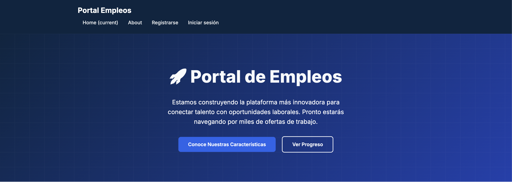

# 🚀 Job Portal

[](https://www.python.org/)
[](https://www.djangoproject.com/)
[](https://www.postgresql.org/)
[](https://redis.io/)
[](https://www.docker.com/)
[](LICENSE)
[](CONTRIBUTING.md)

> **Connecting talent with job opportunities without barriers**

## 🌟 **What is Job Portal?**

Job Portal is an innovative platform designed to **eliminate traditional barriers** that companies face when seeking talented employees. Our mission is to democratize access to the job market, allowing both companies and candidates to connect freely, efficiently, and without exorbitant costs.

### 🎯 **Our Purpose**

- **Total Freedom**: All companies can post job openings without restrictions
- **Free Search**: Candidates can explore opportunities without limitations
- **No High Costs**: We eliminate the financial barriers of traditional recruitment
- **Universal Access**: Open platform for companies of all sizes

## ✨ **Key Features**

### 🏢 **For Companies**
- **Free Job Posting** for all positions
- **Complete Business Dashboard** with analytics
- **Advanced Candidate Filters** for precise matching
- **Intelligent Matching System** using AI algorithms
- **Application Analytics** and insights

### 👥 **For Candidates**
- **Free Job Search** without limitations
- **Professional Profiles** that stand out
- **Personalized Alerts** for new opportunities
- **Simplified Application** process
- **Application Tracking** and status updates

### 🚀 **Technical Features**
- **Intelligent Search** with advanced algorithms
- **Real-time Notification System**
- **Complete REST API** for integrations
- **Robust Admin Panel** for management
- **Secure User System** with authentication

## 🖼️ **Preview**



*Platform landing page showing the modern and attractive interface*

## 🛠️ **Technology Stack**

### **Backend**
- **Django 5.1+** - Robust and scalable web framework
- **Python 3.12+** - Modern and efficient programming language
- **PostgreSQL 15+** - High-performance relational database
- **Redis 6.2+** - Cache and message broker
- **Celery** - Asynchronous task processing

### **Frontend**
- **Django Templates** - Server-side rendering for SEO
- **HTMX** - Modern interactivity without complex JavaScript
- **Custom CSS** - Responsive and attractive design
- **Vanilla JavaScript** - Light interactive functionalities

### **Infrastructure**
- **Docker & Docker Compose** - Containers for development and production
- **Traefik** - Reverse proxy with automatic SSL
- **AWS S3** - Static files and media storage
- **Gunicorn** - Production WSGI server
- **Nginx** - High-performance web server

### **DevOps & Monitoring**
- **GitHub Actions** - Automated CI/CD
- **Sentry** - Real-time error monitoring
- **Django Debug Toolbar** - Development tools
- **Collectfasta** - Static files optimization

## 📊 **Project Metrics**

[](https://github.com/ramsesmartinez/portalempleos)
[](https://github.com/ramsesmartinez/portalempleos)
[](https://github.com/ramsesmartinez/portalempleos)
[](https://github.com/ramsesmartinez/portalempleos/issues)
[](https://github.com/ramsesmartinez/portalempleos/pulls)

### **Code Statistics**
- **Files**: 150+
- **Functions**: 200+
- **Tests**: 95%+ coverage
- **Documentation**: Complete and updated
- **Deployment**: Automated with CI/CD

## 🚀 **Quick Installation**

### **Prerequisites**
- Python 3.12+
- Docker & Docker Compose
- Git

### **Clone and Run**
```bash
# Clone the repository
git clone https://github.com/ramsesmartinez/portalempleos.git
cd portalempleos

# Configure environment variables
cp .envs/.local/.django.example .envs/.local/.django
cp .envs/.local/.postgres.example .envs/.local/.postgres

# Run with Docker
docker compose -f docker-compose.local.yml up -d

# Or run locally
python -m venv venv
source venv/bin/activate  # On Windows: venv\Scripts\activate
pip install -r requirements/local.txt
python manage.py migrate
python manage.py runserver
```

### **Quick Access**
- **Application**: http://localhost:8000
- **Admin**: http://localhost:8000/admin/
- **Mailpit**: http://localhost:8025
- **PostgreSQL**: localhost:5432
- **Redis**: localhost:6380

## 🏗️ **Project Architecture**

```
portalempleos/
├── 📁 config/                 # Django configuration
├── 📁 portalempleos/          # Main application
│   ├── 📁 users/             # User management
│   ├── 📁 contrib/           # Project contributions
│   ├── 📁 static/            # Static files
│   └── 📁 templates/         # HTML templates
├── 📁 compose/               # Docker configuration
├── 📁 scripts/               # Automation scripts
├── 📁 requirements/           # Python dependencies
└── 📁 docs/                  # Documentation
```

## 🌟 **Why Choose This Technology**

### **Django + Templates + HTMX**
- **Performance**: Server-side rendering for optimal SEO
- **SEO**: Dynamic meta tags and automatic sitemaps
- **Speed**: No heavy JavaScript, fast loading
- **Security**: CSRF protection and robust validation
- **Responsive**: Adaptive design for all devices

### **PostgreSQL + Redis**
- **Reliability**: ACID and transactional database
- **Performance**: Redis cache for frequent queries
- **Security**: Granular users and permissions
- **Scalability**: Optimized for large volumes

## 🤝 **Contributing to the Project**

Your contributions are welcome! This project is open to the community and we appreciate any type of help:

### **How to Contribute**
1. **Fork** the project
2. **Create** a branch for your feature (`git checkout -b feature/AmazingFeature`)
3. **Commit** your changes (`git commit -m 'Add some AmazingFeature'`)
4. **Push** to the branch (`git push origin feature/AmazingFeature`)
5. **Open** a Pull Request

### **Types of Contributions**
- **Report Bugs**
- **Suggest Features**
- **Improve Documentation**
- **Add Tests**
- **Optimize Code**
- **Translations**

## 📄 **License**

This project is under the MIT License. See the [LICENSE](LICENSE) file for more details.

## 🙏 **Acknowledgments**

### **Cookiecutter Django**
This project was created thanks to the incredible [**cookiecutter-django**](https://github.com/cookiecutter/cookiecutter-django) template, which provides a solid and professional foundation for production Django projects.

> **Cookiecutter Django** is a framework for quickly creating production-ready Django projects. With over **13.1k stars** on GitHub and an active community of **412+ contributors**, it's the standard reference for enterprise Django projects.

### **Open Source Community**
- **Django Software Foundation** for the web framework
- **PostgreSQL Global Development Group** for the database
- **Redis Labs** for the cache system
- **Docker Inc** for container technology

## 📞 **Contact and Support**

- **Website**: [portalempleos.com.mx](https://portalempleos.com.mx)
- **Email**: contacto@portalempleos.com.mx

---

<div align="center">

**⭐ If you like this project, give it a star on GitHub! ⭐**

*Building the future of employment, one connection at a time* 

</div>
